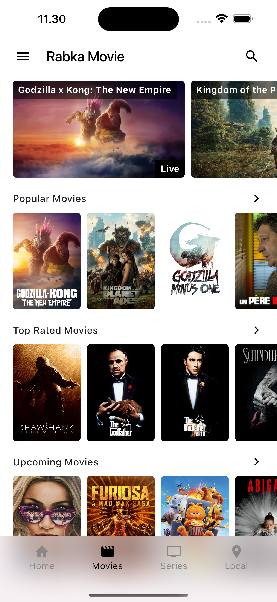
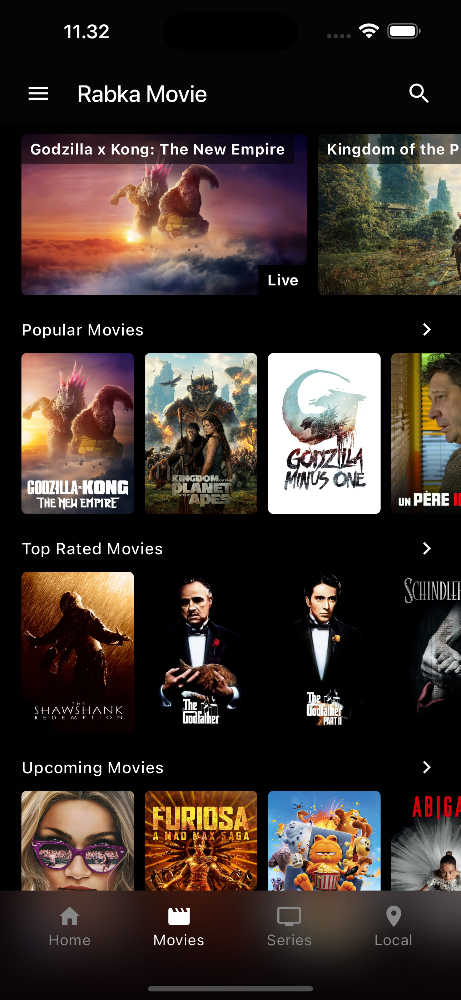
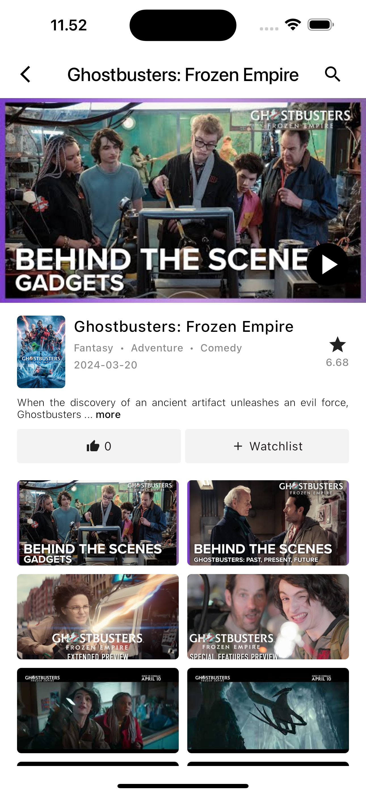
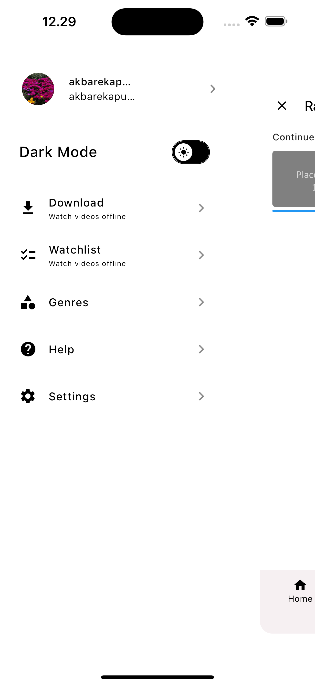
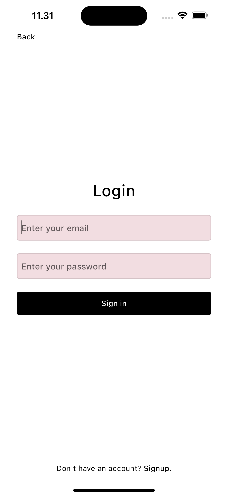
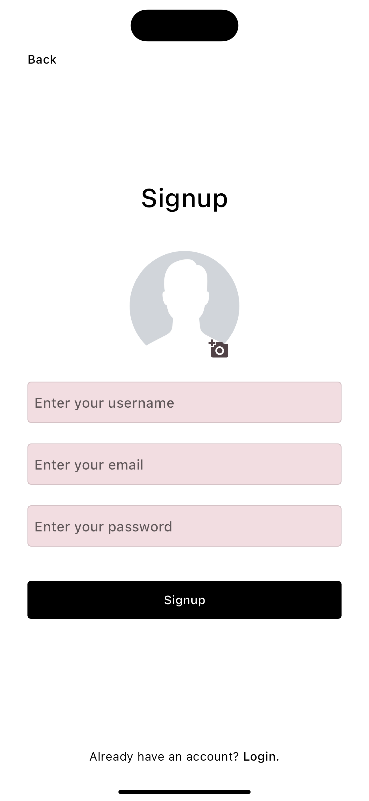
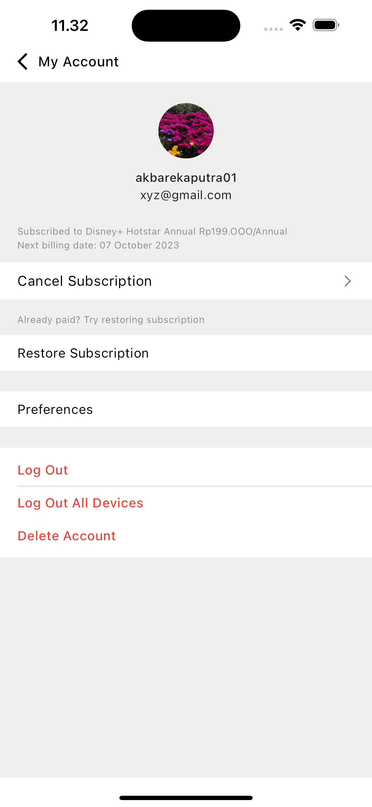
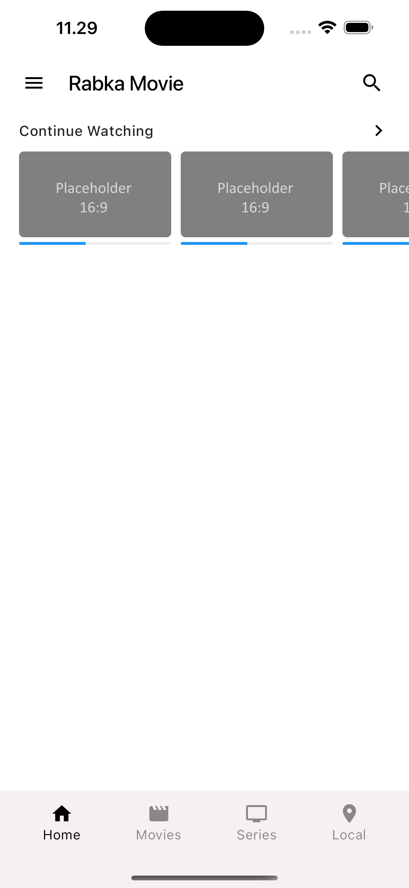

# Rabka Movie App

This is a Flutter application that displays a list of movies fetched from The Movie Database (TMDB) API and is integrated with Firebase for additional features such as user authentication, liking movies, and supporting both dark mode and light mode.

## Features

- Fetch movie data from the TMDB API
- Display a list of movies with details such as title, synopsis, and image
- User authentication with Firebase (Email and Password)
- Save liked movies to Firebase Firestore
- Support for both dark mode and light mode
- Responsive design for both Android and iOS

## Screenshots

| Light Mode                                                                        | Dark Mode                                                                       | Movie List                                                     |
| --------------------------------------------------------------------------------- | ------------------------------------------------------------------------------- | -------------------------------------------------------------- |
|  |  |  |

| Detail Screen                                                  | Side Nav                                             | Login Screen                                                 |
| -------------------------------------------------------------- | ---------------------------------------------------- | ------------------------------------------------------------ |
|  |  |  |

| Signup Screen                                                  | Profile Screen                                                   | Home Screen                                                |
| -------------------------------------------------------------- | ---------------------------------------------------------------- | ---------------------------------------------------------- |
|  |  |  |

## Getting Started

### Requirements

- Flutter installed on your development machine. You can follow the [official Flutter installation guide](https://flutter.dev/docs/get-started/install) for instructions.
- A Firebase project set up. You can create a new project in the [Firebase Console](https://console.firebase.google.com/).
- An API key from [The Movie Database (TMDB)](https://www.themoviedb.org/documentation/api).

### Installation

1. Clone this repository:

   ```sh
   git clone https://github.com/yourusername/rabka_movie_flutter.git
   cd rabka_movie_flutter
   ```

2. Install dependencies:

   ```sh
   flutter pub get
   ```

3. Set up Firebase:

   - Go to the Firebase Console, select your project.
   - Add an Android/iOS app to your Firebase project and follow the instructions to download the `google-services.json` (for Android) or `GoogleService-Info.plist` (for iOS).
   - Place the `google-services.json` file in the `android/app` directory.
   - Place the `GoogleService-Info.plist` file in the `ios/Runner` directory.
   - Follow the additional setup instructions provided by Firebase for integrating with Flutter.

4. Configure Firebase in your Flutter app:

   - Ensure the dependencies are added to your `pubspec.yaml` file:

   ```yaml
   dependencies:
     cloud_firestore: latest_version
    cupertino_icons: latest_version
    firebase_auth: latest_version
    firebase_core: latest_version
    firebase_database: latest_version
    firebase_storage: latest_version
    flutter:
      sdk: flutter
    flutter_advanced_drawer: latest_version
    flutter_dotenv: latest_version
    http: latest_version
    image_picker: latest_version
    provider: latest_version
    uuid: latest_version
    youtube_player_flutter: latest_version
   ```

5. Set up TMDB API:

   - Create an account and get an API key from [TMDB](https://www.themoviedb.org/documentation/api).
   - Add your TMDB API key to a configuration file or as an environment variable.

6. Run the app:
   ```sh
   flutter run
   ```

## Usage

1. Launch the app on your device or emulator.
2. Sign up or log in using your email and password.
3. Browse the list of movies fetched from the TMDB API.
4. Tap on a movie to view more details.
5. Like a movie to add it to your favorites, which are saved to Firebase Firestore.
6. Toggle between dark mode and light mode in the side navbar.

## API

This app uses the [TMDB API](https://www.themoviedb.org/) to fetch movie data. Make sure to check their documentation for more details.

## Firebase

This app uses Firebase for user authentication and Firestore for saving user-specific data such as liked movies. Make sure to set up Firebase correctly by following the installation steps above.

## Contribute

If you would like to contribute to this project, please fork the repository and create a pull request with your changes.

## Contact

For any questions or suggestions, please contact [akbarekaputra01](mailto:akbarekaputra01@gmail.com) or dm me on instagram @akbarekaputra01
